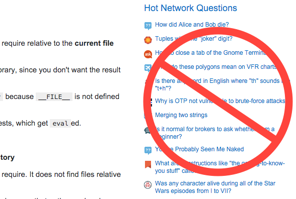

# Stack Block



Sometimes, you just want to read technical questions and answers, and not be distracted by whether or not Darth Vader truly renounced the dark side in the moments before his death.

This Chrome extension blocks the Hot Network Questions, Careers, Hire Me, and other sections on Stack Overflow and Stack Exchange, so you can get back to work.

## Development

Clone the repository and `cd` into it.

```bash
git clone https://github.com/jeffcole/stack-block.git
cd stack-block
```

Install dependencies.

```bash
npm install
node_modules/.bin/bower install
```

Build and watch the project.
```bash
node_modules/.bin/gulp watch
```

In Chrome, go to `chrome://extensions`, enable 'Developer mode', click 'Load unpacked extension', and navigate to and select the `app` directory of the project.

For more information on development see the [Yeoman Chrome extension generator] used by this project.

## Chrome Web Store

The extension is available for installation on the Chrome Web Store [here][Web Store].

## License

Copyright © 2016 Jeff Cole. See [LICENSE](LICENSE) for more information.


[Web Store]: https://chrome.google.com/webstore/detail/stack-block/oaimjdjckmmblefojgncilidkkandhbl
[Yeoman Chrome extension generator]: https://github.com/yeoman/generator-chrome-extension
