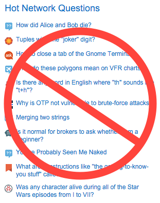

# Stack Block



Sometimes, you just want to read technical questions and answers, and not be distracted by whether or not Darth Vader truly renounced the dark side in the moments before his death.

This Chrome extension blocks the Hot Network Questions, Careers, Hire Me, and other sections on Stack Overflow and Stack Exchange, so you can get back to work.

## Install

Clone the repository and `cd` into it.

```bash
git clone https://github.com/jeffcole/stack-block.git
cd stack-block
```

Install dependencies.

```bash
npm install
node_modules/.bin/bower install
```

Build the project.
```bash
node_modules/.bin/gulp build
```

In Chrome, go to `chrome://extensions`, enable 'Developer mode', click 'Load unpacked extension', and navigate to and select the `app` directory of the project.

## License

© 2016 Jeff Cole. See [LICENSE](LICENSE) for more information.
